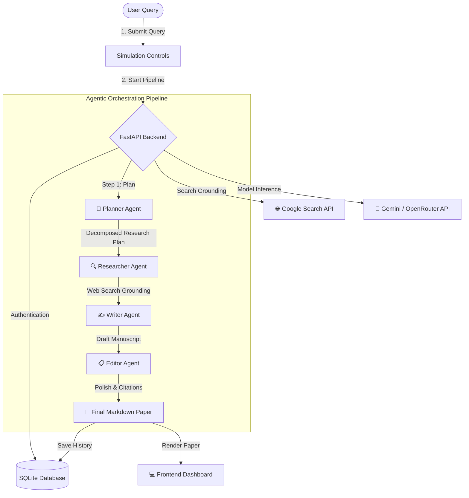

# 🧪 Agentic Lab: Multi-Agent Research Assistant

[](https://react.dev/)
[](https://fastapi.tiangolo.com/)
[](https://sqlite.org/)
[](https://vite.dev/)
[](https://ai.google.dev/)
[](https://www.framer.com/motion/)

**Agentic Lab** is a full-stack, state-of-the-art Multi-Agent Research System that automates the generation of highly detailed, academic-grade research papers. Utilizing an orchestration pipeline of four specialized AI agents (Planner, Researcher, Writer, and Editor) powered by **Google Gemini** and **OpenRouter**, the system searches the web in real-time, compiles evidence-grounded reports, and persists user sessions.

---

## 🗺️ System Architecture & Workflow

The system uses a sequential multi-agent flow where each agent passes its output as context to the next, building up a detailed and cohesive final paper.



---

## ✨ Key Features

*   **🤖 Multi-Agent Orchestration Flow:** Watch the Planner, Researcher, Writer, and Editor work collaboratively in a visual SVG network graph that glows and pulses during execution.
*   **🌐 Real-Time Google Search Grounding:** The Researcher Agent uses live Google Search Grounding to extract up-to-date facts, statistics, and references.
*   **🛠️ Self-Healing Zero-Credit Fallback:** If your OpenRouter API keys run low on credits (returning `HTTP 402`), the backend automatically and silently switches to a free reasoning model (`openrouter/free`) at a full 4000 token limit so the simulation never fails.
*   **🔐 Full-Stack Authentication & Sync:** Users can register and log in. Once authenticated, their research history is saved to a local SQLite database and synchronized on reload.
*   **🗑️ Database-Backed Archive Deletion:** Easily clear unwanted papers from the sidebar; deletions are mirrored immediately on both local storage and the SQLite database.
*   **🎛️ Dynamic Speed & Custom Modes:** Test preset queries or submit your own custom research topics. Fine-tune the simulation speed using custom state variables.
*   **🎨 Premium Cybernetic Theme System:** Toggle between **Light**, **Dark (Deep Space)**, and **System (Hacker Terminal)** modes with smooth, hardware-accelerated CSS color-fade transitions.

---

## 🛠️ Tech Stack

*   **Frontend:** React, Vite, Zustand (State Management), Framer Motion (Animations), Lucide Icons, ReactMarkdown (Markdown + LaTeX rendering)
*   **Backend:** Python, FastAPI, SQLite (Local database), PyJWT (Authentication), Bcrypt (Password hashing), Requests (API streaming)
*   **AI Models:** Google Gemini 2.5 Flash / Gemini 3.5 Flash (via OpenRouter or native SDK)

---

## 🚀 Getting Started (Local Setup)

### Prerequisites
*   Python 3.10+
*   Node.js 18+

### 1. Backend Setup
1.  Navigate to the `backend` folder:
    ```bash
    cd backend
    ```
2.  Create and activate a virtual environment:
    ```bash
    python -m venv venv
    # On Windows (PowerShell):
    .\venv\Scripts\Activate.ps1
    # On macOS/Linux:
    source venv/bin/activate
    ```
3.  Install dependencies:
    ```bash
    pip install -r requirements.txt
    ```
4.  Create a `.env` file inside the `backend/` directory:
    ```env
    PORT=5000
    SECRET_KEY=your_super_secret_jwt_key
    GEMINI_API_KEY=your_google_gemini_or_openrouter_api_key
    ```
5.  Start the FastAPI server:
    ```bash
    python app.py
    ```
    *The server will run on `http://localhost:5000`.*

### 2. Frontend Setup
1.  Navigate to the `frontend` folder:
    ```bash
    cd ../frontend
    ```
2.  Install packages:
    ```bash
    npm install
    ```
3.  Create a `.env` file inside the `frontend/` directory (optional fallback):
    ```env
    VITE_GEMINI_API_KEY=your_optional_client_side_api_key
    ```
4.  Start the Vite dev server:
    ```bash
    npm run dev
    ```
    *The site will run on `http://localhost:5173` (or `http://localhost:5174`).*

---

## ☁️ Deployment Guide (How to host it)

Because this application uses a stateful backend (FastAPI + SQLite), deploying it requires hosting the frontend and backend separately. 

### 🖥️ 1. Frontend Deployment (Vercel)
The React/Vite frontend is stateless and can be hosted for **free on Vercel**:
1.  Push your code to a GitHub repository.
2.  Import the repository into **Vercel**.
3.  Configure the root directory to `frontend`.
4.  Add any necessary Environment Variables (e.g. `VITE_GEMINI_API_KEY` if you want users to optionally use client-side keys).
5.  Click **Deploy**.

### ⚙️ 2. Backend Deployment (Render or Railway)
Vercel is serverless and **cannot** host long-running Python servers or write to a local SQLite file (`research_assistant.db`) persistently. Instead, use a container or service hosting provider like **Render** or **Railway**:

#### Option A: Render.com (Web Service)
1.  Create a new Web Service on Render and link your GitHub repository.
2.  Set the Root Directory to `backend`.
3.  Set the Runtime to `Python 3`.
4.  Configure the Start Command:
    ```bash
    uvicorn app:app --host 0.0.0.0 --port $PORT
    ```
5.  **Database Persistence (Crucial):**
    *   Since SQLite stores data in a file (`research_assistant.db`), you should add a **Persistent Disk (Volume Mount)** in the Render dashboard (e.g., mount a 1GB disk to `/data`).
    *   Update the database path in your code or configure the database location in `/data/research_assistant.db` to keep users' data from getting wiped when Render restarts the service.
6.  Add environment variables:
    *   `SECRET_KEY` (For JWT)
    *   `GEMINI_API_KEY` (Your OpenRouter/Gemini key)

#### Option B: Docker Deployment (Railway or Google Cloud Run)
We have included a production-ready `Dockerfile` in the `backend/` directory. You can deploy this container directly to Cloud Run or Railway:
1.  Link your GitHub repo to Railway.
2.  Railway will automatically detect the `Dockerfile` inside the `backend/` directory and deploy it as a Docker service.
3.  Mount a persistent volume to preserve the `.db` file.

---

## 📝 License
Distributed under the MIT License. See `LICENSE` for more information.
